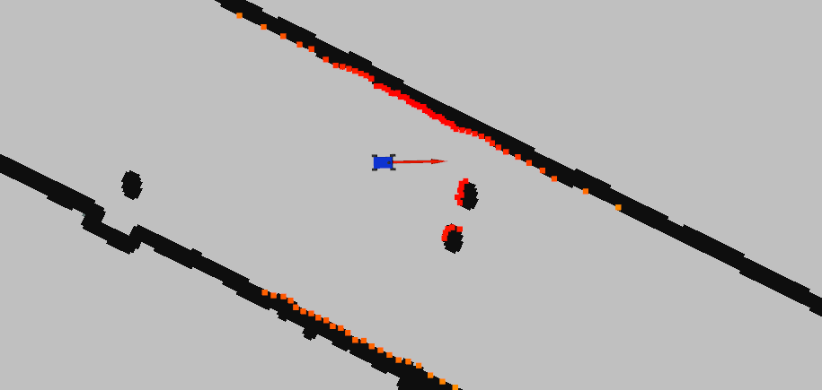

### A lightweight simulator of the [MIT Racecar](https://github.com/mit-racecar/racecar_simulator), modified by PUT Motorsport.



## TODO
- [ ] zintegrować maszynę stanu z tym jakoś
- [ ] wykrywanie kolizji
- [ ] jakiś prosty system autonomiczny, który będzie sobie jeździł do jakiegoś punktu
- [ ] chyba wsio

# Dependency
* ros-melodic
* python2/3

# Usage
* installation
```bash
mkdir -p ~/sim_ws/src
cd ~/sim_ws/src
git clone https://github.com/MatPiech/Control_Theory_project.git
cd Control_Theory_project/
git checkout sim
cd ../../
catkin_make
```

* run simulate
```bash
roslaunch racecar_simulator simulate.launch
```

* run console controler
```bash
roslaunch racecar_simulator racecar_teleop_key.launch
```
