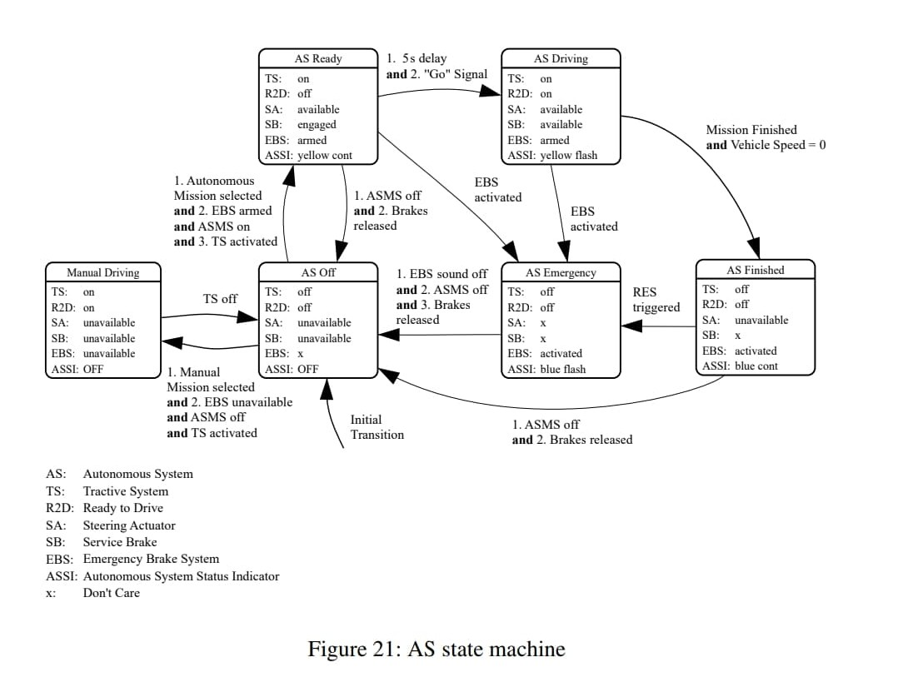

# Control Theory project

### Project requirements
------------------------
1. Choose of application
2. State Machine implementation
3. State Machine visualization
4. Graph analysis
5. Process visualization

### Environment requirements
----------------------------
1. Create an environment
```console
conda env create -f environment.yml
```
2. Activate an environment 
```console
conda activate ts
```

### Application description
---------------------------
Selected application describe Autonomous System for Formula Student Driverless Class.



Not included on graph description:
- ASMS - Autonomous System Master Switch

State Machine source [FSG 2020 rules](https://www.formulastudent.de/fileadmin/user_upload/all/2020/rules/FS-Rules_2020_V1.0.pdf) (page 93).

### State Machine implementation
--------------------------------
To implement Autonomous System State Machine was used StateMachine package. It let to create State Machine, States and Transitions between them. ([PyPI](https://pypi.org/project/python-statemachine/), [Docs](https://python-3-patterns-idioms-test.readthedocs.io/en/latest/StateMachine.html))

#### Autonomous System State Machine run
```python
from AutonomousSystem import AutonomousSystem as AS

SM = AS()
```
#### Check current state, all states, all transitions
```python
SM.current_state
# ASOff('AS Off', identifier='as_off', value='as_off', initial=True)
[s.identifier for s in SM.states]
# ['as_driving', 'as_emergency', 'as_finished', 'as_off', 'as_ready', 'manual_driving']
[s.identifier for s in SM.transitions]
# ['driving', 'emergency1', 'emergency2', 'finished', 'manual', 'off1', 'off2', 'off3', 'off4', 'ready']
```
#### Change state (transit to next another state)
```python
SM.current_state
# ASOff('AS Off', identifier='as_off', value='as_off', initial=True)
SM.ready()
SM.current_state
# ASReady('AS Ready', identifier='as_ready', value='as_ready', initial=False)
```

### State Machine visualization
-------------------------------

### Graph analysis
------------------

### Process visualization
-------------------------
A racing car simulation is in [sim branch](https://github.com/MatPiech/Control_Theory_project/tree/sim).

### List of contributors
------------------------
1. Michał Barełkowski
2. Mateusz Piechocki
3. Bartosz Ptak

