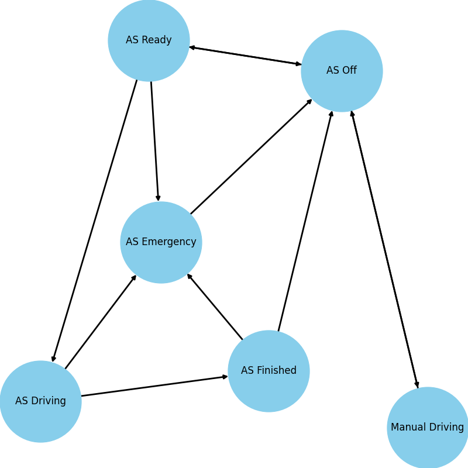

# Control Theory project
Repository contain project of Autonomous System State Machine with simulator in ROS for Control Theory project lecture.
### Project tasks
------------------------
1. ~~Choose of application~~
2. ~~State Machine implementation~~
3. ~~State Machine visualization~~
4. ~~Graph analysis~~
5. Process visualization

### Environment requirements
----------------------------
1. Create an environment
```console
conda env create -f environment.yml
```
2. Activate an environment 
```console
conda activate ts
```

### Application description
---------------------------
Selected application describes Autonomous System for Formula Student Driverless Class race car.


Not included on graph description:
- ASMS - Autonomous System Master Switch

State Machine source [FSG 2020 rules](https://www.formulastudent.de/fileadmin/user_upload/all/2020/rules/FS-Rules_2020_V1.0.pdf) (page 93).

### State Machine implementation
--------------------------------
To implement Autonomous System State Machine was used StateMachine package. It let to create State Machine, States and Transitions between them. ([PyPI](https://pypi.org/project/python-statemachine/), [Docs](https://python-3-patterns-idioms-test.readthedocs.io/en/latest/StateMachine.html))

#### Autonomous System State Machine run
```python
from AutonomousSystem import AutonomousSystem as AS

SM = AS()
```
#### Check current state, all states, all transitions
```python
SM.current_state
# ASOff('AS Off', identifier='as_off', value='as_off', initial=True)
[s.identifier for s in SM.states]
# ['as_driving', 'as_emergency', 'as_finished', 'as_off', 'as_ready', 'manual_driving']
[s.identifier for s in SM.transitions]
# ['driving_emergency', 'driving_finished', 'emergency_off', 'finished_emergency', 'finished_off', 'manual_off', 'off_manual', 'off_ready', 'ready_driving', 'ready_emergency', 'ready_off']
```
To check mapped states one can use:
```python
SM.states_map
```
While to check mapped transition one can use:
```python
SM.transitions_map
```
#### Change state (transit to next another state)
```python
SM.current_state
# ASOff('AS Off', identifier='as_off', value='as_off', initial=True)
SM.ready()
SM.current_state
# ASReady('AS Ready', identifier='as_ready', value='as_ready', initial=False)
```
To change state with use of `transitions_map` dictionary one can use:
```python
SM.transitions_map[<transition>]._run(SM)
```
Where `<transition>` is an identifier of transition.

### State Machine visualization
-------------------------------
To visualize implemented graph networkx package was used. It is library for the creation, manipulation, and study of the structure, dynamics, and functions of complex networks. ([PyPI](https://pypi.org/project/networkx/),[Docs](https://networkx.github.io/documentation/stable/))

To visualize created state machine one can use:
```console
cd autonomous_system/visualize/
python graph_creator.py
```
In the result one can get graph as below.


### Graph analysis
------------------
To check correctness of created state machine and if it doesn't contain any deadlocks or livelocks unittest framework was used. It checks if  state machine has implemented right quantity of states and transitions for every state. Moreover it verifies if current state changes in a correct way after transition according to one of available paths. ([Docs](https://docs.python.org/3/library/unittest.html))

To run tests one can used command as below:
```console
cd autonomous_system/test/
python test_autonomous_system.py
```

### Process visualization
-------------------------
A racing car simulation is in [sim branch](https://github.com/MatPiech/Control_Theory_project/tree/sim).

### List of contributors
------------------------
1. [Michał Barełkowski](https://github.com/embe97)
2. [Mateusz Piechocki](https://github.com/MatPiech)
3. [Bartosz Ptak](https://github.com/bartoszptak)


