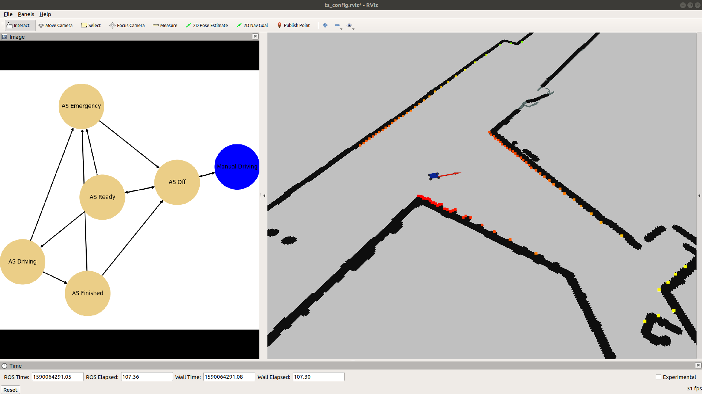
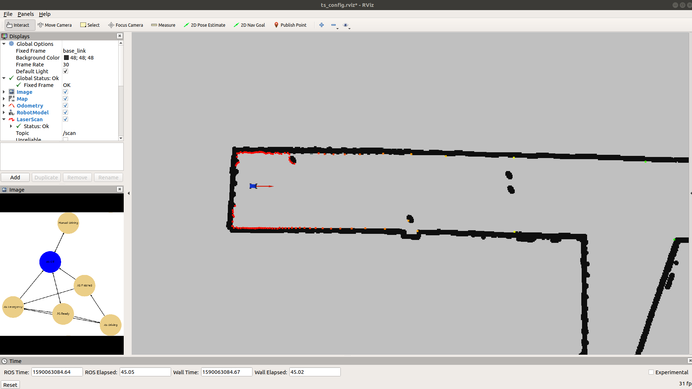
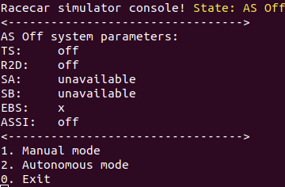

# Racecar Autonomous System State Machine Simulator
A lightweight ROS Melodic simulator based on [MIT racecar](https://github.com/mit-racecar/racecar_simulator).



# Dependency
* ros-melodic
* python2
* python's packages in config/requirements.txt

# Usage
* installation
```bash
mkdir -p ~/racecar_state_machine_ws/src
cd ~/racecar_state_machine_ws/src
git clone https://github.com/MatPiech/racecar_state_machine.git
cd racecar_state_machine/
git checkout sim
pip2 install -r config/requirements.txt
cd ../../
catkin_make
source devel/setup.bash
```

* run simulator
```bash
roslaunch racecar_simulator simulate.launch
```


* run console controler
```bash
roslaunch racecar_simulator racecar_teleop_key.launch
```


## TODO
- Update documentation
- Add simple autonomous system (point to point driving)
- Update console controller
